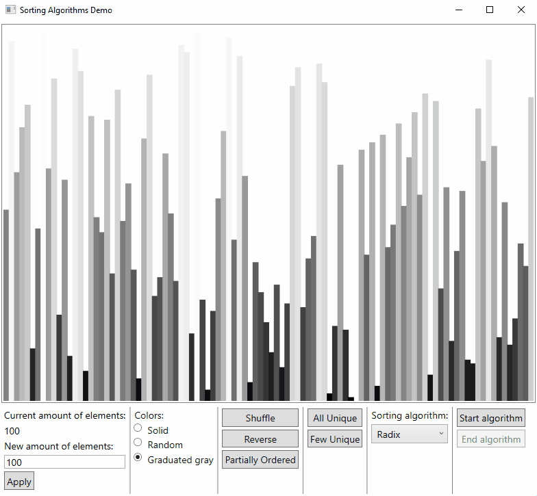

# Sorting-Algorithms-Demo
WPF app for demonstrating various sorting algorithms
## Available sorting algorithms
* Bubble sort
* Insertion sort
* Merge sort
* Selection sort
* Shaker sort
* Shell sort
* Quick sort
* Stooge sort
* Pancake sort
* Gnome sort
* Counting sort
* Radix sort
* Comb sort
* Odd-even sort
* Tree sort
* Heap sort
* Cycle sort
* Bitonic sort
## Demonstration

## Libraries
* [System.Drawing.Common](https://www.nuget.org/packages/System.Drawing.Common/)
* [Microsoft.Tookit.Mvvm](https://github.com/CommunityToolkit/WindowsCommunityToolkit)
